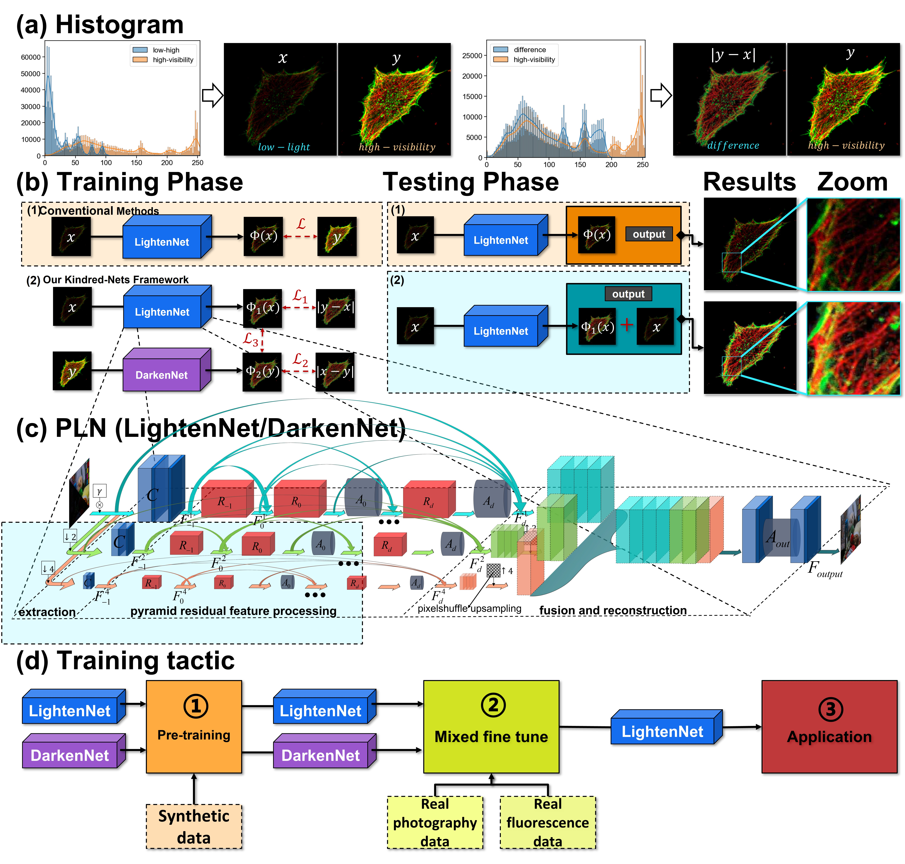

# KindredNets (Deep Low-Excitation Fluorescence Imaging Enhancement)

By YUANJIE GU,† ZHIBO XIAO,† WEI HOU, CHENG LIU, YING JIN, AND SHOUYU WANG*

This work is submitted to arXiv and Optica. Good luck to us.
This repo provides simple testing codes, pretrained models and the network strategy demo.


## BibTex

```
@ARTICLE{#################################################}
```

## Complete Architecture

The complete framework of KindredNets is shown as follows,



# Implementation

## This work was inspired by the following work
```
@ARTICLE{DLN2020,
  author={Li-Wen Wang and Zhi-Song Liu and Wan-Chi Siu and Daniel P.K. Lun},
  journal={IEEE Transactions on Image Processing}, 
  title={Lightening Network for Low-light Image Enhancement}, 
  year={2020},
  doi={10.1109/TIP.2020.3008396},
}
```
https://github.com/WangLiwen1994/DLN
thanks！！！
## Prerequisites

- Python 3.5
- NVIDIA GPU + CUDA
- [optional] [sacred+ mongodb (experiment control)](https://pypi.org/project/sacred/) 

## Getting Started

### Installation

- Install PyTorch and dependencies from http://pytorch.org
- Install python libraries:

```bash
pip install pillow, opencv-python, scikit-image, sacred, pymongo
```

- Clone this repo


### Testing

- A few example test images are included in the `./test_img` folder.
- Please use trained model`./Lighten_pretrained_best_psnr2140-ssim8001.pth` and `Darken_pretrained_best_psnr2140-ssim8001.pth`
  - Put them under `./models/`
- Test the model by:

```bash
python test.py --modelfile models/PLN_pretrained.pth

# or if the task towards image enhancement with mixed fine tune.
python test.py --modelfile models/PLN_CFFI_LOL.pth
```

The test results will be saved to the folder: `./output`.


### Dataset

- Download the VOC2007 dataset and put it to "datasets/VOC2007/".
- Download the LOL dataset and put it to "datasets/LOL".
- We provide a valuable confocal fluorescence microscopy dataset CFFI in "datasets/CFFI".
- Mixed fine tune dataset is combined whit the LOL dataset and our CFFI dataset.

### Training

It needs to manually switch the training dataset: 

1) first, train from the synthesized dataset, 
2) then, load the pretrained model and train with mixed fine tune dataset.

```bash
python train.py 
```

### Then run test to applications.
